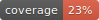

CKWatson
========
[](https://standardjs.com)
[](https://github.com/psf/black)
[](https://github.com/pre-commit/pre-commit)
[](https://github.com/astral-sh/uv)



CKWatson is an educational game about [chemical kinetics][ck]. The game is organized in "puzzles". Each puzzle starts off with a few reactants.
Within a given set of all substances possibly present, the player's goal is to figure out all [elementary reactions][er] involved with the chemical process when the reactants are mixed together.

> Elementary [reactions], my dear Watson!


[ck]: https://chem.libretexts.org/Bookshelves/General_Chemistry/Map%3A_Chemistry_-_The_Central_Science_(Brown_et_al.)/14%3A_Chemical_Kinetics
[er]: https://chem.libretexts.org/Bookshelves/Physical_and_Theoretical_Chemistry_Textbook_Maps/Supplemental_Modules_(Physical_and_Theoretical_Chemistry)/Kinetics/03%3A_Rate_Laws/3.02%3A_Reaction_Mechanisms/3.2.01%3A_Elementary_Reactions

([live demo](https://ckwatson.onrender.com/))

[](https://render.com/deploy)

## Installation

```shell
git clone --recurse-submodules https://github.com/ckwatson/ckwatson.git
cd web_gui
uv sync
```

## Setup

To run CKWatson with Redis and gunicorn:

1. In one terminal, execute `redis-server`.
2. Then, in another terminal: `just run`.

_Alternatively_, you can run the boot script directly: `uv run run.py`.

This uses Flask itself to host the server, but would lose the ability to send [Server-Sent Events](https://github.com/singingwolfboy/flask-sse).

## Deployment

### Via Docker

You can either run CKWatson as a single container or with Redis using Docker Compose.

To run CKWatson as a single container:
1. Build the image: `docker build -t ckw .`
2. Start a container: `docker run -p 80:80 --rm --name ckwatson ckw`

To run CKWatson with Redis, simply use `docker-compose up`.

### Via Kubernetes

I will be using [minikube](https://minikube.sigs.k8s.io/) in this walkthrough. I will be using the local Docker Registry as the source of the Kubernetes image.

> **Note:** For production or remote clusters, push your image to a container registry and set `imagePullPolicy: IfNotPresent` or `Always` in the deployment YAML.
> The provided YAMLs now include resource requests/limits and health checks for better stability.

```shell
# Start the cluster:
minikube start
# Register the Docker Registry to minikube -- This is because we will be building the image from the Dockerfile for Kubernetes:
eval $(minikube docker-env)
# Build the Docker image for Kubernetes:
docker build -t ckw .
# Apply the Deployment and Service manifests:
kubectl apply -f ./k8s
# Access the web app:
minikube service web
```

#### Troubleshooting

- If you see `ImagePullBackOff`, ensure you ran `eval $(minikube docker-env)` before building.
- For production, set up resource limits and health checks (already included in the YAMLs).
- For Redis security in production, set a password and update the deployment and app config accordingly.

## Folder Structure

- `kernel` does the chemistry.
- `puzzles` stores definitions of puzzles. Admin can add puzzles to the game using the `create` page.
- `web` powers the web app.

## Testing

This project uses [`pytest`][pt] for testing Python code. Run:

```shell
PYTHONPATH=. uv run pytest --cov=web/ --cov=kernel/engine/ ; uv run coverage-badge -f -o coverage.svg
```

[pt]: https://docs.pytest.org/en/stable/
